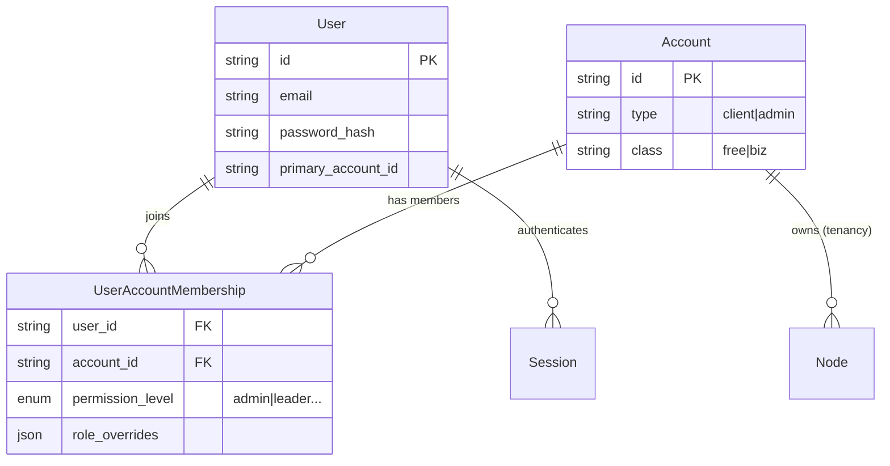

# System Architecture: Contacts, Accounts, and Tenancy

> [!NOTE]
> This document outlines the core data models and security architecture as defined in `packages/db` and `apps/api`.

## Core Entities & Relationships

The system uses a **Many-to-Many (M:N)** relationship between **Users** and **Accounts** to handle multi-tenancy.



### 1. Account (Tenant)
The **Account** is the fundamental unit of tenancy.
- **Isolation**: All data (Nodes, Jobs, Uploads) belongs to a single Account via `account_id`.
- **Types**:
    - `client`: Standard workspace for users.
    - `admin`: Internal management account.
- **Classes**: `free`, `professional`, `business` (determines feature limits).

### 2. User (Identity)
The **User** represents a global identity that can belong to multiple accounts.
- **Profile**: There is no separate "Profile" table. User attributes (`name`, `email`, `global_preferences`) constitute the profile.
- **Primary Account**: Each user has a `primary_account_id` for default login routing.

### 3. Contacts (Memberships)
There is **no explicit "Contact" table** in the database.
- **Concept**: A "Contact" is essentially a **User** who is a member of an **Account**.
- **Management**: You manage "Contacts" by inviting Users to your Account via the `user_accounts` table.
- **CRM Links**: The `account_links` table acts as a CRM layer, allowing "Admin" accounts to manage "Client" accounts.

---

## Tenancy & Security

### Multi-Tenancy Model
The system enforces tenancy at the database level and application layer.
1.  **Session Context**: Every `Session` is bound to an `operating_account_id`.
2.  **Data Isolation**: All queries for resources (Nodes, Jobs) MUST filter by `account_id` derived from the current session.
3.  **Cross-Account Access**: Users can switch between accounts they belong to (`user_accounts`), but they can only operate in **one account at a time**.

### Roles & Permissions (RBAC)
Roles are defined per-account in the `user_accounts` table.

#### Standard Roles (`permission_level`)
| Role | Rank | Description |
| :--- | :--- | :--- |
| **Admin** | 4 | Full access to settings, billing, and user management. |
| **Leader** | 3 | Can manage content and view some settings. |
| **Senior** | 2 | Standard contributor permissions. |
| **Junior** | 1 | Restricted access (read-only or limited write). |

#### Granular Overrides
The `role_overrides` JSON column allows toggling specific capabilities per user, independent of their base role.

```json
// Example role_overrides
{
  "can_delete_nodes": false,
  "can_invite_users": true
}
```

### Authentication Flow
1.  **Login**: Validates `email` + `password` against the `users` table.
2.  **Account Selection**:
    - If User has 1 Account -> Auto-login.
    - If User has >1 Accounts -> Returns `tempToken` for Account Selection UI.
3.  **Session Creation**: A persistent `Session` is created linked to the selected `operating_account_id`.

---

## Summary of Terms

| Term | Implementation | Definition |
| :--- | :--- | :--- |
| **Tenancy** | `account_id` column | Strict data isolation per Account. |
| **Contact** | `user_accounts` | A User who is a member of an Account. |
| **Profile** | `users` table | User's global identity and preferences. |
| **Role** | `permission_level` | Access level within a specific Account. |
